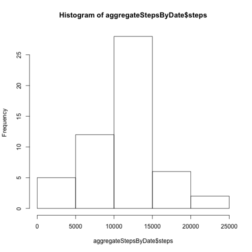
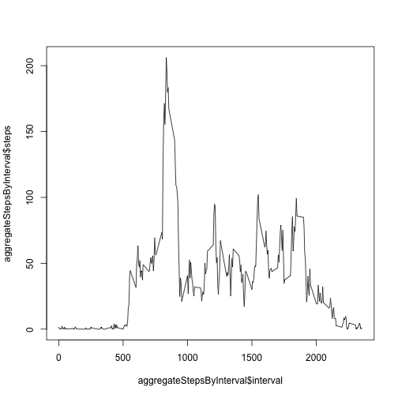
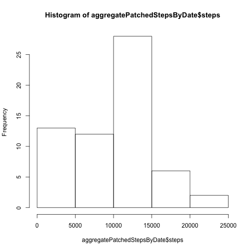

# Reproducible Research: Peer Assessment 1
This is the peer assignment 1 for reproducible research

## Loading and preprocessing the data
* Load the data (i.e. read.csv())

```r
activity <- read.csv("activity.csv")
```

## What is mean total number of steps taken per day?
* Make a histogram of the total number of steps taken each day  

```r
aggregateStepsByDate <- aggregate(steps ~ date, data = activity, FUN = "sum")
hist(aggregateStepsByDate$steps)
```

 
  
* Calculate and report the mean and median total number of steps taken per day  

```r
mean <-mean(aggregateStepsByDate$steps)
median <-median(aggregateStepsByDate$steps)
```
The mean total number of steps taken per day is **1.0766 &times; 10<sup>4</sup>**.  
The median is **10765**.  


## What is the average daily activity pattern?
* Make a time series plot (i.e. type = "l") of the 5-minute interval (x-axis) and the average number of steps taken, averaged across all days (y-axis).  

```r
aggregateStepsByInterval <- aggregate(steps ~ interval, data = activity, FUN = "mean")
plot(aggregateStepsByInterval$interval, aggregateStepsByInterval$steps, type = "l")
```

 

* Which 5-minute interval, on average across all the days in the dataset, contains the maximum number of steps?  

```r
maxSteps <- max(aggregateStepsByInterval$steps)
i <- which.max(aggregateStepsByInterval$steps)
maxInterval <- aggregateStepsByInterval$interval[i]
```
The value is **835**.  

 
## Imputing missing values
* Calculate and report the total number of missing values in the dataset (i.e. the total number of rows with NAs)  

```r
totNa <- sum(is.na(activity$steps))
```
Total no of missing values is **2304**.  

* Devise a strategy for filling in all of the missing values in the dataset. The strategy does not need to be sophisticated. For example, you could use the mean/median for that day, or the mean for that 5-minute interval, etc.  
The strategy I am using is to use **0** for *NA*.  
  
* Create a new dataset that is equal to the original dataset but with the missing data filled in.  

```r
activityPatched <- read.csv("activity.csv")
indexNa <- which(is.na(activityPatched$steps))
activityPatched$steps[indexNa] <- 0
```

* Make a histogram of the total number of steps taken each day and Calculate and report the mean and median total number of steps taken per day.

```r
aggregatePatchedStepsByDate <- aggregate(steps ~ date, data = activityPatched, FUN = "sum")
hist(aggregatePatchedStepsByDate$steps)
```

 

```r
meanP <-mean(aggregatePatchedStepsByDate$steps)
medianP <-median(aggregatePatchedStepsByDate$steps)
```
The mean value is 9354.2295. The median value is 1.0395 &times; 10<sup>4</sup>.  

* Do these values differ from the estimates from the first part of the assignment?  
Yes.
* What is the impact of imputing missing data on the estimates of the total daily number of steps?  
Since NA vaues were replaced with 0, it reduced the mean and median values.

## Are there differences in activity patterns between weekdays and weekends
* Create a new factor variable in the dataset with two levels – “weekday” and “weekend” indicating whether a given date is a weekday or weekend day.  

```r
activityPatched[, 4] <- "weekday"
names(activityPatched)[4] <- "isWeekend"
for (i in 1:dim(activityPatched)[1]) {
    wd <- weekdays(as.Date(activityPatched$date[i]))
    if (wd == "Sunday" | wd == "Saturday") {
        activityPatched$isWeekend[i] <- "weekend"
    }
}
activityPatched$isWeekend <- as.factor(activityPatched$isWeekend)

stepsByIntervalNew <- aggregate(steps ~ interval + isWeekend, data = activityPatched, FUN = "mean")
```


* Make a panel plot containing a time series plot (i.e. type = "l") of the 5-minute interval (x-axis) and the average number of steps taken, averaged across all weekday days or weekend days (y-axis).  

```r
library(lattice)
xyplot(steps ~ interval | isWeekend, stepsByIntervalNew, layout = c(1, 2), type = "l")
```

 
